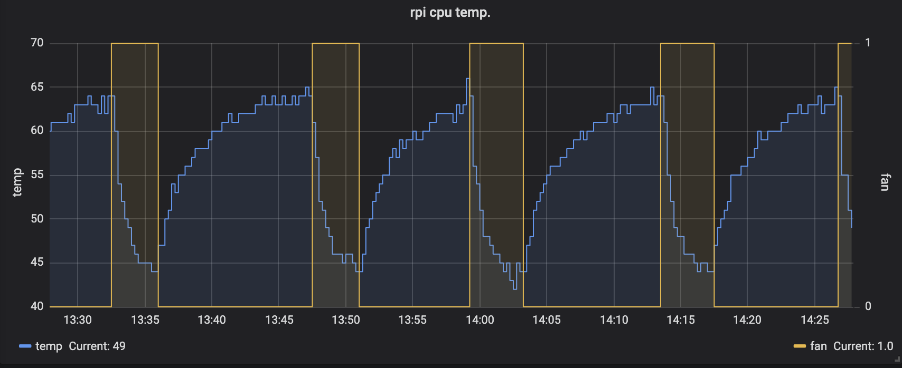

# Fan SHIM C++ Driver

This project is a C++-based driver for the [Pimoroni Fan SHIM](https://shop.pimoroni.com/products/fan-shim).

The driver has the following dependencies:

| Library                                                            | Minimum Version |
| ------------------------------------------------------------------ | --------------- |
| [`libgpiod`](https://libgpiod.readthedocs.io/en/latest/index.html) | 1.6.3           |
| [`libuv`](https://libuv.org/)                                      | 1.43.0          |
| [`libspdlog`](https://github.com/gabime/spdlog/wiki)               | 1.9.2           |
| ['json'](https://github.com/nlohmann/json)                         | 3.11.2          |

The `install-dependencies.sh` script will install the requisite dependencies on Debian-based systems.

## Build

Both GNU and Clang toolchains have been tested, it is recommended that the `CC` and `CXX` environment variables are used to set the desired compiler. For example, to use the Clang toolchain
run the following before using `cmake`:

```bash
export CC=/usr/bin/clang
export CXX=/usr/bin/clang++
```

To install this driver, the it is recommended to use `install.sh`, as it will configure and install the driver as a systemd service:

```bash
./install.sh
```

### Developer loop

If you are a developer and wish to make modifications and test, using `cmake` commands as follows will allow you to build and test:

```bash
cmake -S . -B build
cmake --build build
```

### Installation

The driver can be installed with a systemd service (`fanshim-driver`) using the `instal.sh` script or the `--install` flag to cmake:

```bash
cmake --install build
```

The `install.sh` script will enable the service automatically.

## Driver Configuration

 The behavior of the driver can be driven by a configuration file located at `/etc/fanshim.json`. This file is read in at runtime. If any value is invalid, the entire
 configuration will revert to default.

 All fields in the configuration file are optional, except `on-threshold` and `off-threshold` which must be specified as a pair.

 The JSON file supports the following configuration items:

 | Configuration Item  | Type    | Description                                                        | Valid Values                                                 |
 | ------------------- | ------- | ------------------------------------------------------------------ | ------------------------------------------------------------ |
 | `on-threshold`      | Integer | Sets the temperature, in degrees celsius, for turning the fan ON.  | Value must be greater than 0                                 |
 | `off-threshold`     | Integer | Sets the temperature, in degrees celsius, for turning the fan OFF. | Value must be greater than 0, less than `on-threshold` value |
 | `delay`             | Integer | The time, in seconds, between checking the CPU temperature.        | Value must be greater than 0                                 |
 | `brightness`        | Integer | The brightness of the LED.                                         | Value must be greater than 0, less than 31                   |
 | `breath-brightness` | Integer | The max brightness to use when "breathing" the LED.                | Value must be greater than 0, less than 31                   |
 | `blink`             | Integer | The type of LED blink behavior.                                    | Value must in [0, 1, 2]                                      |
 | `output-file`       | string  | The file to which to write monitoring output.                      | Any string is accepted                                       |
 | `force-file`        | string  | The file to check for fan override behavior.                       | Any string is accepted                                       |

An example of a valid configuration file:

 ```json
 {
    "on-threshold": 65,
    "off-threshold": 45,
    "delay": 7,
    "blink": 1,
    "output-file": "/home/pi/fanshim.prom"
}
 ```

### Default Values

If the configuration file is not present or is invalid, the following values will be used:

 | Configuration Item  | Default Value                              |
 | ------------------- | ------------------------------------------ |
 | `on-threshold`      | 60                                         |
 | `off-threshold`     | 50                                         |
 | `delay`             | 10                                         |
 | `brightness`        | 0                                          |
 | `breath-brightness` | 10                                         |
 | `blink`             | 0                                          |
 | `output-file`       | `/usr/local/etc/node_exp_txt/cpu_fan.prom` |
 | `force-file`        | `/usr/local/etc/.force_fanshim`            |

### LED Behavior

 | `blink` value | LED Behavior                           |
 | ------------- | -------------------------------------- |
 | 0             | LED will not blink                     |
 | 1             | LED will blink when fan is OFF         |
 | 2             | LED will "breathe" when the fan is OFF |

### Overriding Behavior

There are two ways to force the fan on:

* The driver will periodically check for the existence of the `force-file`. If it exists, the driver will drive the fan ON until it no longer exists or the CPU temperature
  is below the `off-threshold`, whichever occurs last.
* If the driver is not driving the fan ON due to the `force-file` or CPU temperature, the button on the FanSHIM will enable the fan for as long as it is pressed.

## Logging and Monitoring

The driver logs to `syslog` by default. If the driver is not behaving as you expect, please check the logs via the following command:

```bash
cat /var/log/syslog | grep fanshim
```

### Monitoring

This driver will output current status to the file (`/usr/local/etc/node_exp_txt/cpu_fan.prom` by default) so that it can be used with external programs to monitor. This file is overwritten
periodically with the current state of the FAN in the format:

```text
# HELP cpu_fanshim text file output: fan state.
# TYPE cpu_fanshim gauge
cpu_fanshim [TRUE|FALSE]
# HELP cpu_temp_fanshim text file output: temp.
# TYPE cpu_temp_fanshim gauge
cpu_temp_fanshim [Temperature in degrees celsius]
```

An example using node_exporter, prometheus, grafana:

 
